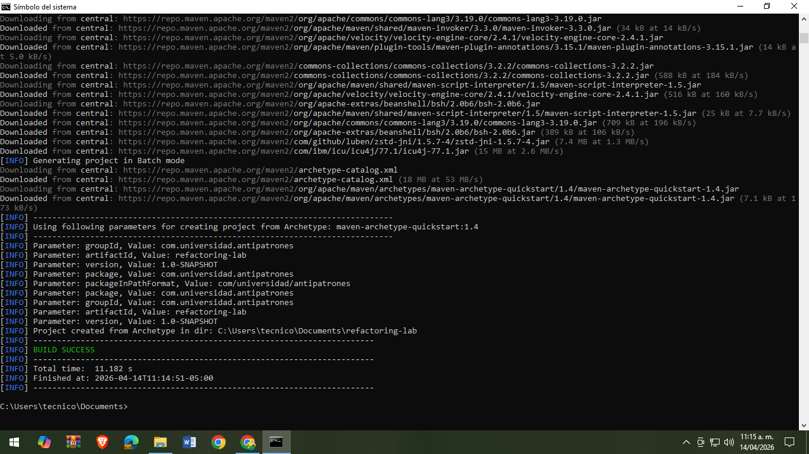
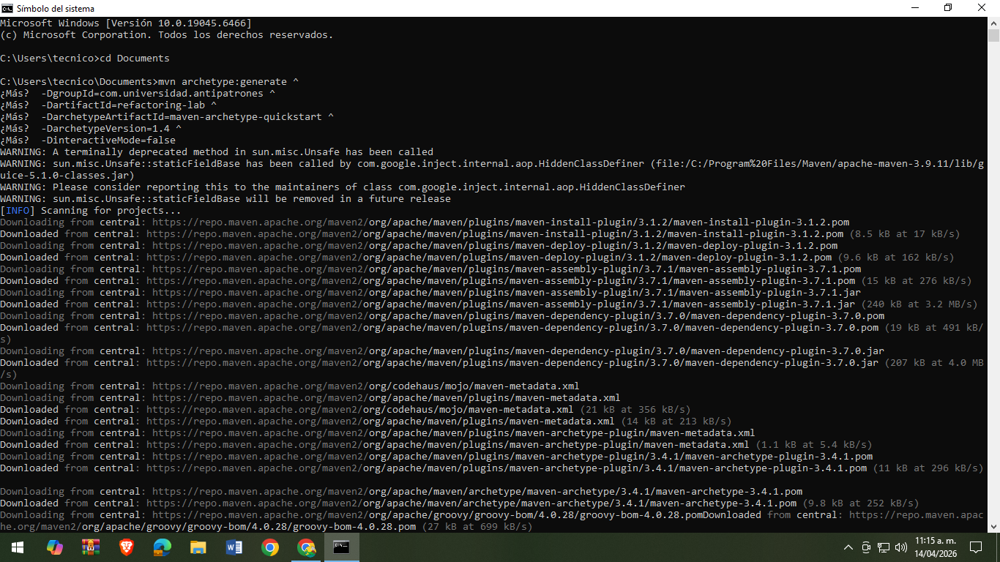
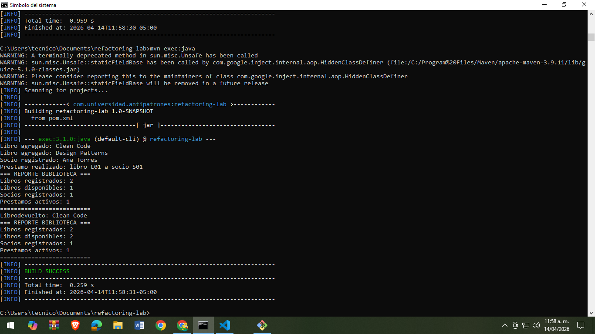
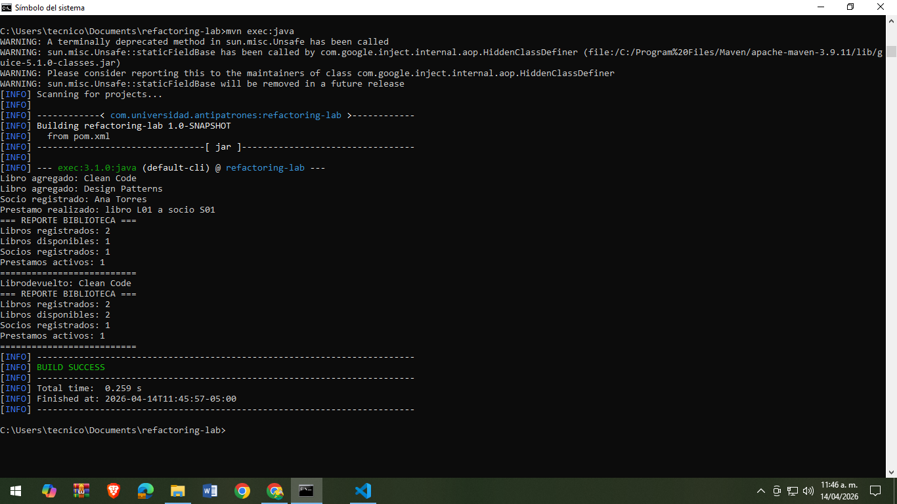
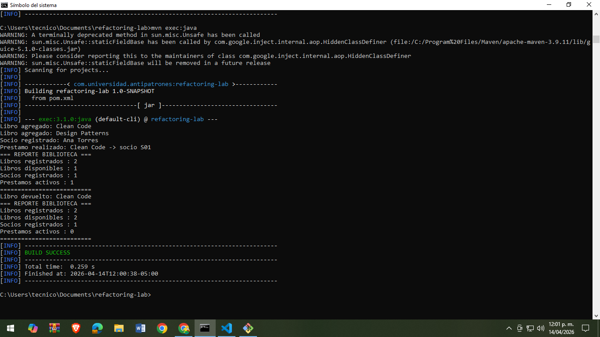

# Refactorización de God Object

## Antipatrón identificado
God Object: una clase con demasiadas responsabilidades.

## Responsabilidades encontradas
1. Gestión de libros
2. Gestión de socios
3. Gestión de préstamos
4. Generación de reportes

## Patrón aplicado
Principio de Responsabilidad Única (SRP)

## Descripción
Se dividió la clase GestorBiblioteca en varias clases especializadas para mejorar el diseño y mantenimiento del código.

## Cómo ejecutar
mvn compile
mvn exec:java

# 📸 Evidencias del proyecto

## 🛠️ Creación del proyecto

## 💻 Creación desde terminal

## ⚙️ Ejecución de clases creadas

## 🚀 Ejecución exitosa en terminal

## 🏁 Ejecución final del proyecto

